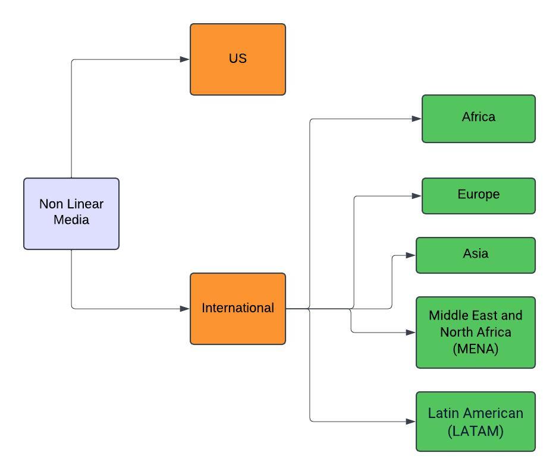
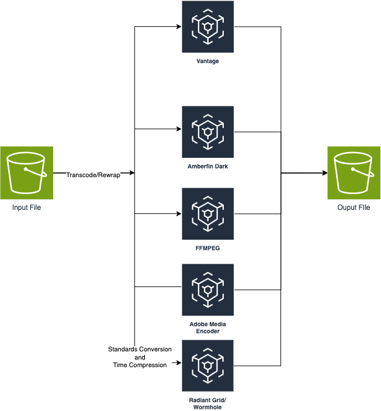

# Media Content Systems Experience

    This is repo is used to demostrate Media Content Systems Experience

## Non Linear Supply Chain International Workflow

## Media Converstion using AWS Infrastructure

Transcoding Tools: 
FFMPEG
- Create proxies
- Convert file to another format - Rewrap
- Create audio files from video files
- Create clips 
Vantage – Transcode and Rewrap
Amberfin Dark- Transcode and Rewrap
Adobe Media Encoder (Media Encoder) – Transcode and Rewrap
Radiant Grid/Wormhole – Standards Conversion and Time Compression

## Create Media system design using diagrams python package
   
    1. `python3 -m venv env`
    2. `source env/bin/activate`
    3. `python -m pip install --upgrade pip`
    4. `pip install -r requirements.txt`
    5. `python media_system_design.py`